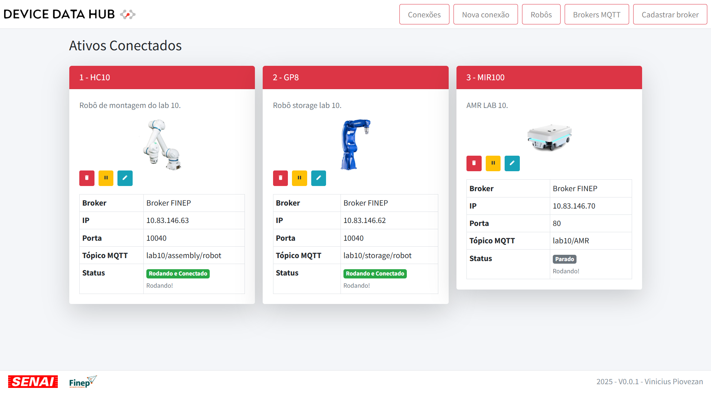

<p align="center">
    &nbsp;&nbsp;&nbsp;&nbsp;&nbsp;&nbsp;&nbsp;&nbsp;
    
</p>


A system developed by SENAI-SP for implementation in a project funded by FINEP.

Device Data Hub is a project aimed at facilitating the distribution of industrial device data for the implementation of digital twins, dashboards, and other systems that can consume MQTT data.

The system provides a web platform where connections with devices can be created and managed.

Device Data Hub centralizes all data collected from devices into MQTT brokers, which can also be registered and linked to an existing connection.


## About Devices

The devices available for connection will be added as needed. It is not possible to add a new device via the web platform, only through code (future implementations may change how this is done).

## Notes Before Getting Started

The goal of this project is not to run in the cloud but rather on a server or computer that must be on the same network as the devices whose data will be collected.

## Running the Project
 
#### Running directly on your OS:

To run the project locally, follow these steps and pay attention to the notes.

- Python 3.13.0 is required.

1. Clone the repository:
```bash
  git clone https://github.com/Piovezan1207/Device-Data-Hub
```

2. Access the project folder:
```bash
  cd Device-Data-Hub
```

3. Install the necessary dependencies:
```bash
    pip install -r requirements.txt
```

4. Initialize your database:
```bash
    python app\infra\sqliteCreateTable.py
```
5. Make a copy of the .env.example file and rename it to .env.

6. Generate a key by running the script below and copy the printed result:
```
   python app\infra\fernetKeyGenerator.py
```

7. Paste the key into the .env file:.
```
   APP_KEY=<COPIED_KEY>
```

8. Access the app folder:
```bash
   cd app
```

9. Run the project:
```bash
   python app.py
```

#### Running with Docker:

1. Clone the repository:
```bash
  git clone https://github.com/Piovezan1207/Device-Data-Hub
```

2. Access the project folder:
```bash
  cd Device-Data-Hub
```

3. Run Docker Compose:
```bash
    docker-compose up -d
```

## Docker Hub

[Device Data Hub](https://hub.docker.com/r/piovezan1207/device-data-hub)

## License

[MIT](https://choosealicense.com/licenses/mit/)


